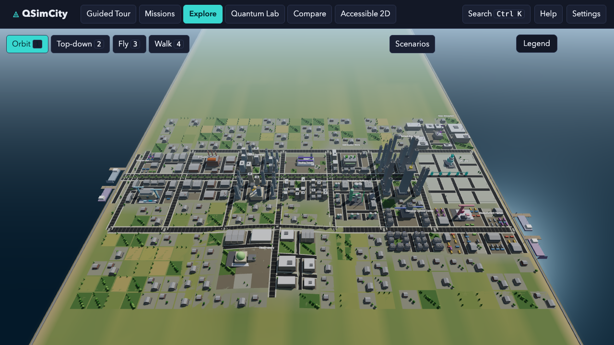
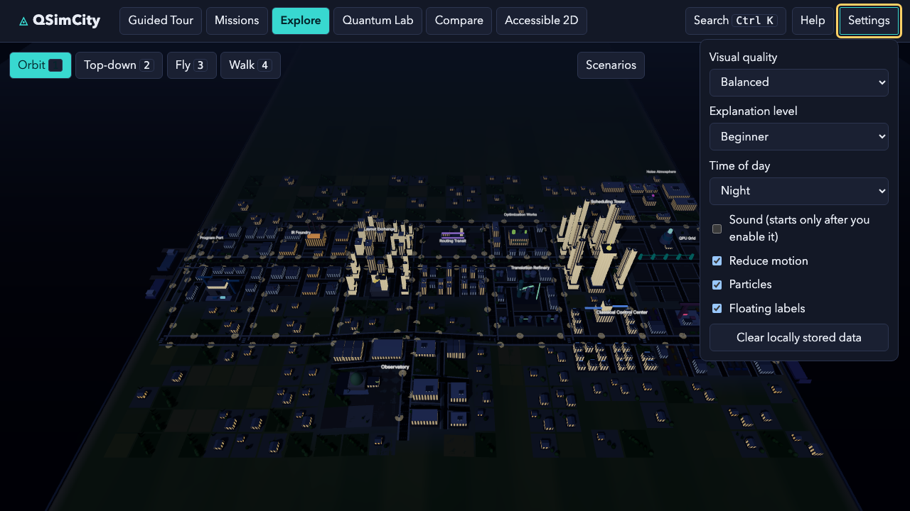
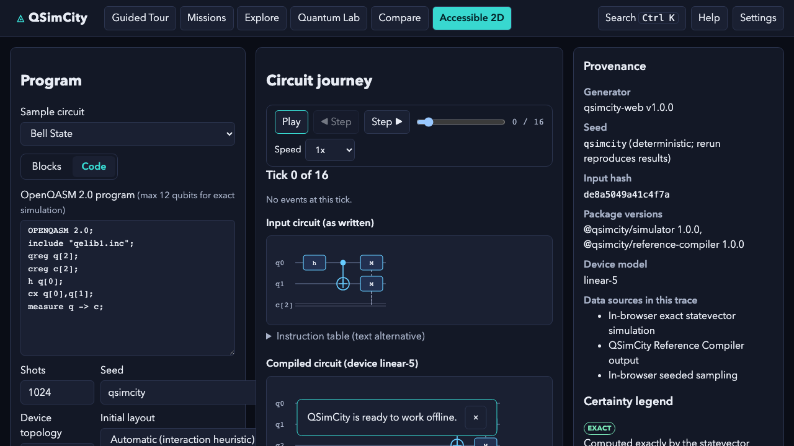

# QSimCity

**See what actually happens to your quantum program between "I wrote a
circuit" and "here are my results."**

QSimCity is a browser-based, client-side 3D visualisation of the quantum
compilation and execution pipeline. You build a circuit; it is parsed, laid
out, routed with real SWAP insertion, translated, optimised, scheduled,
executed with optional noise, measured, and fed back — and every stage
happens in a district of a city you can fly over and walk through. Every
light that *means* something is driven by a real computation trace — the
City Legend says which ones those are and which are scenery — and every
number on screen says how certain it is.

> QSimCity is an **unofficial, independent, open-source educational and
> research visualization project**, released under the Apache License 2.0.
> It is not produced, endorsed, sponsored, or approved by Electronic Arts,
> Maxis, IBM, or any quantum-hardware vendor. All artwork is original and
> generated procedurally from source.

**Live: <https://qsimcity.vercel.app>** — verified reachable. It currently
serves `main`; the branch under review is not deployed. See
[Live URL and demo status](#live-url-and-demo-status).

## The learning gap

Newcomers meet quantum computing as circuit diagrams and state vectors, and
leave with two wrong ideas.

**"The circuit I write is the circuit that runs."** Introductions stop at
the abstract circuit, so the compiler is invisible — the thing that decides
where your logical qubits live, inserts SWAPs to drag distant qubits
together, rewrites gates into the machine's basis, cancels what it can, and
schedules the rest. Learners are then baffled that a circuit they wrote in
two gates arrives at the machine as a longer, differently shaped one.

**"A quantum state is a thing that travels."** Popular animations show
glowing orbs sliding along wires. That transport metaphor later blocks
understanding of measurement, entanglement, and no-cloning.

Circuit composers show the abstract circuit and hide the machine; hardware
dashboards show calibration data and assume you know why it matters.
QSimCity is built for the gap between them.

## The solution

The pipeline *is* the city. A convoy carries your compiled job down the
boulevard, arriving at each district exactly when that stage's events fire.
Logical-qubit banners ride physical pylons and trade places at the tick a
SWAP is inserted. Measured bits leave the harbour as courier vans. Container
stacks grow on the results dock as shots land. Scrub the timeline and every
surface — 3D city, 2D mode, inspector, charts — moves together, because they
all derive from the same `(trace, tick)`.

Two rules make it teach rather than merely impress:

1. **Everything that moves is classical.** Vehicles and people carry
   instructions, jobs, and measured bits — never amplitudes or quantum
   states. The City Legend says so for every animated class, and a test
   enforces it. The transport misconception is designed against — whether
   that design works on real learners is untested.
2. **Every number carries its provenance** — `EXACT`, `COMPUTED`,
   `SAMPLED`, `ESTIMATED`, `CALIBRATION`, `MEASURED`, or `ILLUSTRATIVE` —
   and an "Active simplifications" panel states what the model is not.

## Target audience

Curious beginners from about age 12 up, including secondary students with no
linear algebra; undergraduates meeting compilation for the first time; and
educators or outreach staff who need a 45-minute activity with no
installation. The child reading register and picture-led onboarding serve
the youngest end.

## Learning objectives

After a 45-minute session a learner should be able to explain: that a
compiler rewrites a circuit before it runs; what **layout** does; why
**routing** inserts SWAPs and how that relates to connectivity; what **basis
translation** is; one example of an **optimisation**; what **scheduling**
decides; the difference between a **logical** and a **physical** qubit and
how a SWAP changes the mapping; that **measurement** yields classical bits
and repeated shots yield a distribution; how **noise** shifts that
distribution rather than producing a "wrong answer"; and what **classical
feedback** does with a measured bit.

## Pedagogical sequence

Picture onboarding with a reading-level choice → Mission 1 (Bell pair,
one tap, watch the replay to the end) → Missions 2–7 (a GHZ chain; a
deliberately bad layout whose SWAP cost you then fix; noise; classical
feed-forward; optimisation; sampling statistics) → Guided Tour → free
exploration in the Quantum Lab →
Compare Mode → a five-question picture assessment, growth-framed and never
graded. Full detail in [docs/EDUCATOR_GUIDE.md](docs/EDUCATOR_GUIDE.md),
including a zero-setup 45-minute lesson plan.

## Technologies

three.js (WebGL2) with merged per-material geometry and instanced agents;
React and Zustand; Vite/Rolldown with a PWA service worker; own TypeScript
packages for gates, topologies, seeded RNG, and an OpenQASM 2.0 parser; own
reference compiler (normalise → layout → route → translate → optimise →
schedule); own statevector simulator with noise channels in a Web Worker;
the versioned QSimCity Trace format; an optional Python bridge to Qiskit and
Qiskit Aer for cross-validation; Vitest and Playwright for testing.

## Results and evidence

Every claim is bound to an evidence envelope under `release-evidence/` that
records the source tree it measured; `pnpm goal:check` recomputes the
verdicts and refuses prose as evidence.

| Claim | Evidence |
| --- | --- |
| Simulator agrees with Qiskit Aer | 71 pytest, within sampling tolerance |
| Traces reproduce byte-identically | 12 independent processes agree |
| Compiled circuits preserve measured distributions | `compiled-execution.test.ts` |
| Frame time honestly characterised | p50/p95/p99, long and dropped frames, refresh-cap detection, plus a vsync-disabled ceiling run |
| Repeated 3D/2D mounting is safe | 60 fixed cycles scored on heap slope, absolute growth, mount latency, and the app's own live WebGL contexts |
| Ten-minute production soak | zero uncaught errors, zero console errors |
| Accessibility | Lighthouse 100 on four targets; axe WCAG 2.2 AA |
| Bundle budget | 158 KiB gzip initial JS against 320 KiB; 349 KiB total JS against 600 KiB |
| Builds from a clean clone | 16 verified steps |
| Tests | 942 unit, 94 end-to-end across four browser projects |

**No learning outcomes are claimed** — see
[docs/LEARNING_EVALUATION.md](docs/LEARNING_EVALUATION.md).

## Limitations

No human evaluation has been performed. The adversarial reviews in
`docs/audits/` are **AI-assisted, not independent human validation**. Exact
simulation is capped at 12 qubits. The compiler is a teaching reference, not
Qiskit's transpiler. Noise is a simplified trajectory model and gate
durations are estimates. Playback pacing is presentation time, not hardware
timing. Mobile performance figures are Chromium emulation on a desktop GPU,
not real-device measurements. Full list:
[docs/limitations.md](docs/limitations.md).

## Scalability

A static bundle on a CDN with a service worker: no server, no database, no
per-user cost, and it runs offline after first load — one deployment serves
a classroom or a country. Missions, scenarios, and explanation registers are
data rather than code. WebGL2 is used where available, with a complete
Accessible 2D path that carries the entire workflow on machines without a
GPU. The leveled-text system is the seam a translation would use; only
English exists today. The known ceiling is statevector memory.

## Team and contributions

Solo project by the repository owner (**Doraking**,
<https://github.com/dorakingx>): concept, architecture, implementation,
scientific design, evaluation design, and documentation.

## AI use disclosure

Development was AI-assisted throughout (Claude): implementation, tests,
documentation, and the adversarial reviews. What was AI-generated, what was
human-directed, what is machine-verified, and what remains unverified are
disclosed in [docs/AI_USAGE.md](docs/AI_USAGE.md). The adversarial reviews
are **not** human expert review, independent external validation, or peer
review.

## Live URL and demo status

- **Live application:** <https://qsimcity.vercel.app> — verified reachable
  (HTTP 200), serving `main`. The branch under review is **not deployed**;
  that is a deliberate human decision point.
- **Demo video:** produced and committed in this repository. Path,
  duration, resolution, checksum, and upload instructions are in
  [docs/DEMO_SCRIPT.md](docs/DEMO_SCRIPT.md). It has **not** been uploaded
  and **no public video URL is claimed**.

The full submission package is [docs/WISER_SUBMISSION.md](docs/WISER_SUBMISSION.md).



*A coastal city whose geography is the pipeline: twelve districts along the
Processing Boulevard, west to east, from the Program Port docks to the
Measurement Harbor cranes.*



*The same city at night: lit windows, street lamps, and district accents.*



*Accessible 2D Mode carries the complete workflow without any WebGL.*

## Start in 60 seconds

```bash
corepack enable pnpm && pnpm install && pnpm dev
```

Open the printed URL. No account, no server, no upload — everything runs in
your browser. Node.js 22.12+ is required (`.nvmrc` pins the tested version).

To try the production build instead:

```bash
pnpm build && pnpm --filter qsimcity-web preview
```

## What you can do

| Mode | What it is for |
| --- | --- |
| **Missions** | Seven guided learning missions with a drag-and-drop circuit builder, picture-first onboarding, and machine-checked completion — a first-timer finishes mission 1 from on-screen guidance alone |
| **Guided Tour** | 16 chapters walking the whole pipeline, each stating exactly how exact its claims are |
| **Explore** | Free navigation of the city; select districts, buildings, qubits, and consoles; the City Legend explains everything that moves |
| **Quantum Lab** | Author circuits as code or blocks, configure shots/seed/device/noise, replay the run |
| **Compare** | Ideal vs noisy distributions, and pre- vs post-compilation circuits and metrics |
| **Accessible 2D** | The complete product with no 3D rendering at all, missions included |

Twelve scenarios ship with deterministic seeds: Bell State, GHZ State, Quantum
Teleportation, Grover Search, Quantum Fourier Transform, SWAP Storm, Bad
Initial Layout, Decoherence Weather, Readout Bias, Shot Drought, Dynamic
Feed-forward, and Variational Gridlock (a real VQE loop).

## Controls

| Input | Action |
| --- | --- |
| `1` `2` `3` `4` | Camera: orbit, top-down, fly, first-person walk |
| `W A S D` / arrows | Move (walk/fly) or pan (orbit) |
| Mouse drag / one-finger drag | Rotate the camera |
| Scroll / pinch | Zoom |
| `E` | Operate the nearby console (first-person) |
| `Space` | Play or pause the replay |
| `.` and `,` | Step forward / backward one tick |
| `Ctrl+K` or `/` | Command palette |
| `T` | Guided Tour · `I` Inspector · `?` Help · `Esc` close |

Every control is reachable by keyboard, and every chart has a table
alternative. See [docs/accessibility.md](docs/accessibility.md).

## Supported circuits and limits

- **Input**: OpenQASM 2.0 (`qreg`, `creg`, gate application with register
  broadcasting, custom `gate` definitions, `measure`, `reset`, `barrier`, and
  `if (creg == n)` classical control), plus bundled samples and imported traces.
- **Gates**: `id x y z h s sdg t tdg sx sxdg rx ry rz p u cx cz cp swap ccx`,
  plus the qelib1 macros `u1 u2 u3 cy ch crz cu1 rzz cswap`.
- **Limits**: exact statevector simulation up to **12 qubits**; up to 100,000
  shots; 512 KiB of program text; 32 MiB trace imports. The UI states these
  limits and explains them rather than failing silently.

## How certain is what you see?

Every event, metric, and visual carries a provenance classification, surfaced
as one of seven labels:

| Label | Meaning |
| --- | --- |
| `EXACT` | Computed exactly by the statevector simulator (to floating-point precision) |
| `COMPUTED` | Deterministic output of a real compiler or analysis pass |
| `SAMPLED` | Drawn from seeded random sampling; the seed reproduces it |
| `CALIBRATION` | Reported device calibration data with a source and timestamp |
| `MEASURED` | Imported from a real measurement record |
| `ESTIMATED` | Derived from a simplified model — a proxy, not a measurement |
| `ILLUSTRATIVE` | A visual teaching aid, not derived from computation |

The Provenance panel lists the generator, seed, input hash, package versions,
and every active simplification. QSimCity never claims to show the live
internal state of real hardware, and moving objects in the city are jobs,
instructions, classical messages, and measurement samples — never quantum
amplitudes. See [docs/scientific-accuracy.md](docs/scientific-accuracy.md) and
[docs/scientific-source-ledger.md](docs/scientific-source-ledger.md).

## Scientific limitations

- The browser engine is an **exact statevector simulator** for small circuits,
  not a hardware emulator. There is no pulse-level modelling.
- Noise uses the **quantum-trajectory method**: each shot samples one Kraus
  branch. Ensemble statistics converge to the channel; one trajectory is one
  possible history, never "the" state.
- Gate durations in the schedule are **model values** for teaching
  instruction-level parallelism. They are not measurements of any real device,
  and replay pacing is separate presentation time.
- The **QSimCity Reference Compiler** is deliberately simple and deterministic.
  It is verified to preserve circuit semantics (unitary equivalence up to
  layout permutations) but does not reproduce Qiskit pass for pass.
- No real QPU is used anywhere in v1.

## QSimCity Trace

Every surface — 3D city, Accessible 2D Mode, Observatory, Compare Mode,
Guided Tour, scenarios — replays the same versioned trace format, so they can
never disagree. Traces export as `*.qsimcity.json` and re-import with full
schema validation. Format reference:
[docs/qsimcity-trace.md](docs/qsimcity-trace.md).

## Qiskit Bridge (optional)

The web application never requires Python. The optional bridge captures **real
Qiskit transpiler stages** and Aer results into QSimCity Traces:

```bash
cd python/qsimcity_qiskit
uv sync
uv run pytest
uv run qsimcity-generate traces --circuits-dir ../../examples/circuits --out ../../examples/traces
uv run qsimcity-generate crossval --circuits-dir ../../examples/circuits --out ../../examples/cross-validation/qiskit-results.json
```

The committed traces in `examples/traces/` were produced this way, and their
content hashes are verified from TypeScript on every test run. The browser
simulator is cross-validated against Qiskit statevectors amplitude by
amplitude, and against Aer counts by total-variation distance.

## Privacy

No accounts, no telemetry, no analytics, no uploads. Your program text never
leaves the browser (share links carry only bundled-sample ids and numeric
settings). Settings live in `localStorage` and can be erased from
Settings → "Clear locally stored data". See [docs/privacy.md](docs/privacy.md).

## Testing and verification

```bash
pnpm verify              # typecheck, lint, format, policy scans, unit + integration tests
pnpm test:e2e            # Playwright: Chromium, Firefox, WebKit, mobile
pnpm test:mutation       # generative mutation testing of the scientific core
pnpm verify:release      # everything above plus the production build and budgets
pnpm verify:fresh-clone  # clone this repository and verify it from scratch
pnpm evidence:all        # regenerate every release measurement
pnpm goal:check          # the full Definition-of-Done gate
```

Python bridge: `cd python/qsimcity_qiskit && uv run pytest`.

Each measurement writes an evidence envelope under `release-evidence/`
recording the command, tool version, exit status, thresholds, results, and the
source tree it measured. `pnpm goal:check` derives every mandatory verdict from
those envelopes and refuses any that is missing, stale, or records a failure —
documentation is never accepted in place of a measurement. The individual
generators are `pnpm coverage:check`, `pnpm test:mutation`, `pnpm lighthouse`,
`pnpm soak` (ten minutes), `pnpm security:audit`, `pnpm repro:check`,
`pnpm check:perf`, and `pnpm benchmark:visual`.

## Build and deployment

```bash
pnpm build   # static output in apps/web/dist
```

The canonical deployment target is **Vercel** (`vercel.json` pins the build,
install, output directory, SPA rewrites, security headers, and cache policy),
but the output is a plain static bundle portable to any standards-compliant
static host — there are no serverless functions, databases, or vendor runtime
services. See [docs/deployment-vercel.md](docs/deployment-vercel.md).

## Assets and licenses

All 3D geometry, icons, the logo, and the PWA icons are original and generated
procedurally from source in this repository (`tools/make-icons.ts`,
`packages/world`, `packages/visual-engine`). No third-party art, audio, fonts,
maps, or branding is bundled. Runtime dependencies and their licenses are
recorded in [THIRD_PARTY_NOTICES.md](THIRD_PARTY_NOTICES.md).

### Licensing

QSimCity is licensed under the **Apache License 2.0** (SPDX: `Apache-2.0`) —
see [LICENSE](LICENSE) and [NOTICE](NOTICE). You may use, modify, and redistribute it under those
terms, which include a patent grant and require you to preserve attribution and
state your changes. Selecting a license waited for an explicit decision by the
project owner; the reasoning is recorded in
[ADR-0004](docs/adr/adr-0004-apache-2-0-license.md).

## Documentation

[Product spec](docs/product-spec.md) ·
[Architecture](docs/architecture.md) ·
[Scientific accuracy](docs/scientific-accuracy.md) ·
[Source ledger](docs/scientific-source-ledger.md) ·
[Trace format](docs/qsimcity-trace.md) ·
[Accessibility](docs/accessibility.md) ·
[Performance](docs/performance.md) ·
[Privacy](docs/privacy.md) ·
[Deployment](docs/deployment-vercel.md) ·
[Visual rubric](docs/visual-quality-rubric.md) ·
[Acceptance matrix](docs/acceptance-matrix.md) ·
[Contributing](CONTRIBUTING.md) ·
[Security](SECURITY.md) ·
[Changelog](CHANGELOG.md)
