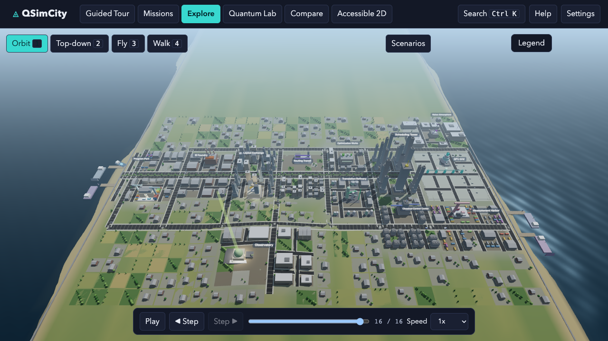
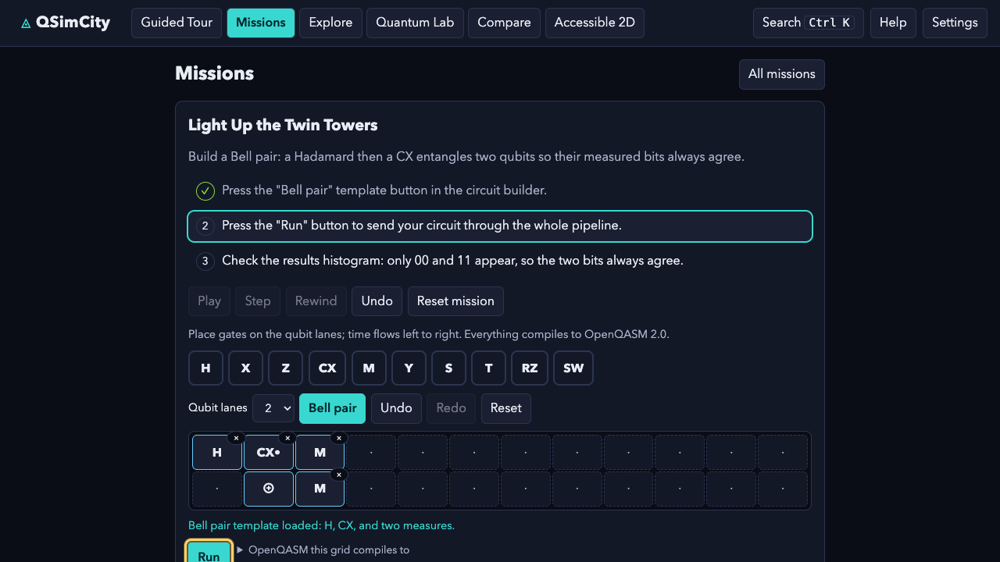
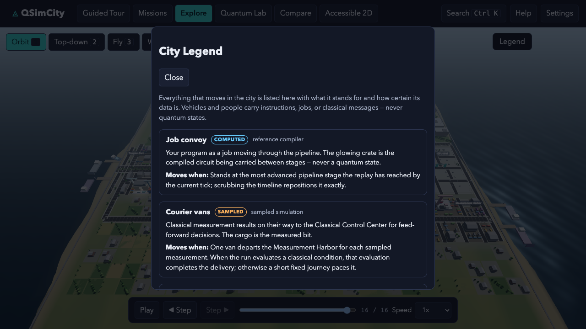
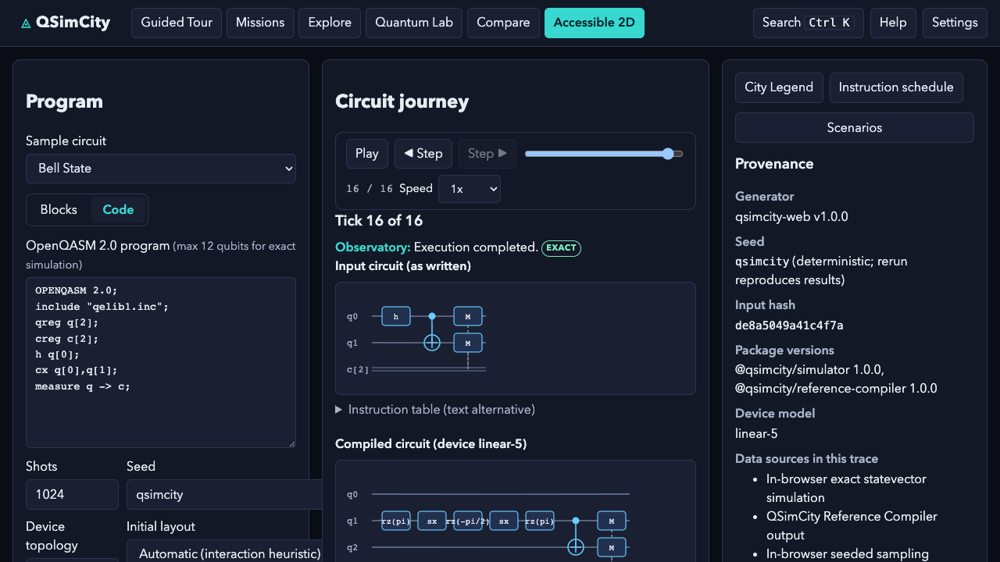
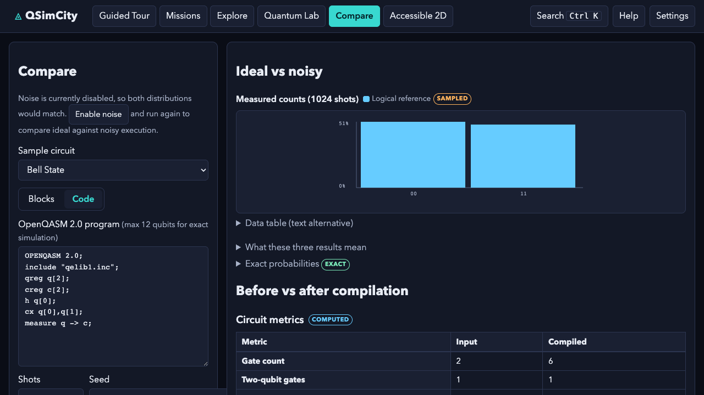
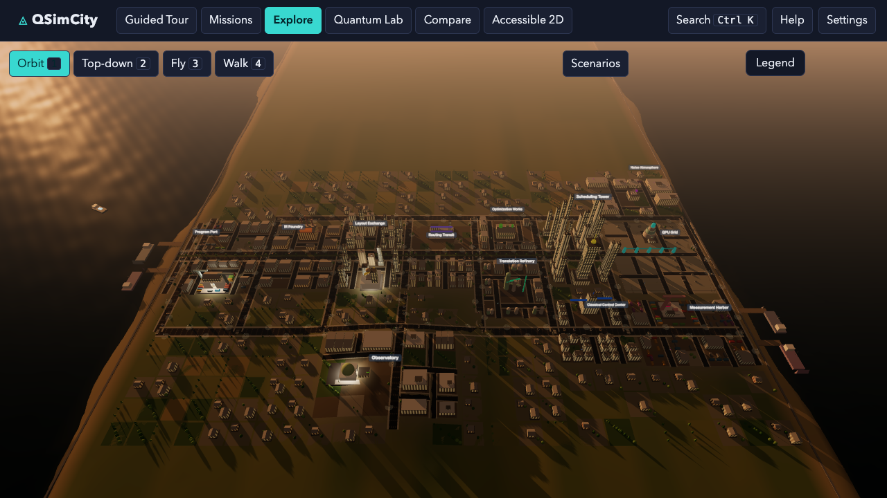
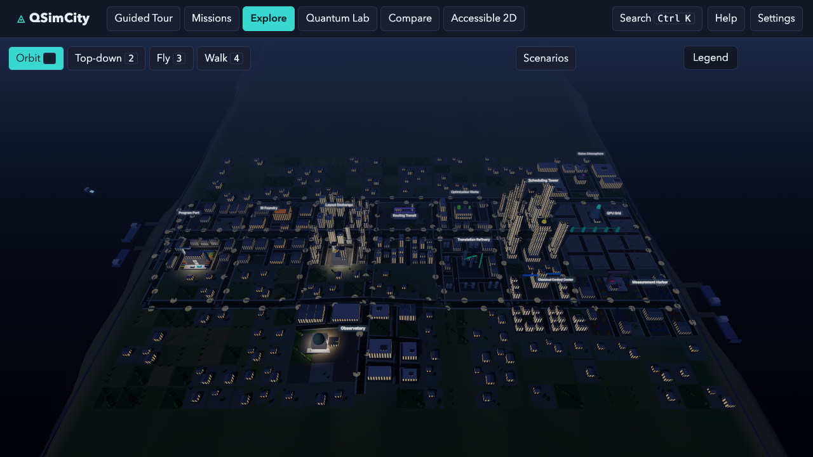
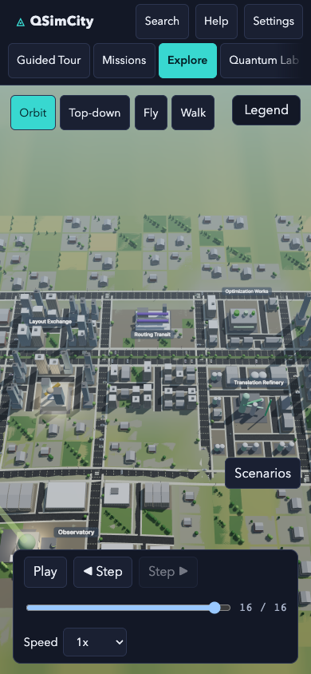

# QSimCity

**See what actually happens to a quantum program between writing a circuit and getting results.**

[](LICENSE)
[](https://github.com/dorakingx/QSimCity/actions/workflows/ci.yml)
[](https://qsimcity.vercel.app)
[](.nvmrc)

[**Open the live app**](https://qsimcity.vercel.app) ·
[**Watch the demo**](release-evidence/demo/qsimcity-demo.mp4) ·
[**Take the guided tour**](https://qsimcity.vercel.app/?view=tour) ·
[**Read the docs**](docs/)



> QSimCity is an unofficial, independent, open-source educational and research project.
> Not affiliated with Electronic Arts, Maxis, IBM, or any quantum-hardware vendor.

## Why it exists

Newcomers meet quantum computing as circuit diagrams and state vectors, and take away two ideas that are wrong in different directions.

**The circuit you write is not the circuit that runs.** Almost every introduction stops at the abstract circuit and hides the compiler — the part that decides where your logical qubits live, inserts SWAP operations to drag distant qubits together, rewrites gates into the machine's basis, cancels what it can, and schedules the result. Learners are then surprised that two gates arrive at the machine as six, and have no intuition for why connectivity and depth dominate practical quantum computing.

**A quantum state is not a thing that travels.** Popular animations show glowing orbs sliding down wires. That builds a transport metaphor which later blocks understanding of measurement, entanglement, and why quantum information cannot be copied or observed in flight.

Circuit composers show the abstract circuit and hide the machine. Hardware dashboards show calibration data and assume you know why it matters. QSimCity is the explorable middle: the pipeline itself, laid out as a city you can fly over and walk through, driven by a real computation trace.

## How the pipeline becomes a city

Every stage of compilation and execution is a district. A job convoy carries your compiled circuit between them, arriving exactly when that stage's events fire in the trace.

```mermaid
flowchart LR
  A["Program Port<br/><small>parse</small>"] --> B["IR Foundry<br/><small>normalize</small>"]
  B --> C["Layout Exchange<br/><small>place qubits</small>"]
  C --> D["Routing Transit<br/><small>insert SWAPs</small>"]
  D --> E["Translation Refinery<br/><small>device basis</small>"]
  E --> F["Optimization Works<br/><small>cancel & fuse</small>"]
  F --> G["Scheduling Tower<br/><small>order in time</small>"]
  G --> H["QPU Grid<br/><small>execute</small>"]
  H --> I["Noise Atmosphere<br/><small>sampled error</small>"]
  I --> J["Measurement Harbor<br/><small>shots land</small>"]
  J --> K["Classical Control<br/><small>feed-forward</small>"]
```



Four steps, from a circuit you author to results you can question.

### 1. Author a circuit

Drag gates onto qubit lanes, or write OpenQASM 2.0. Guided missions walk a beginner through it.



### 2. Watch layout and routing happen

Logical-qubit banners ride physical pylons and trade places at the exact tick a SWAP is inserted. The City Legend names every animated object and says what it stands for.



### 3. Follow the compiled circuit through execution

The same trace renders without WebGL too. Here the input circuit and the compiled circuit sit side by side, with the provenance of every number beside them.



### 4. Measure, then compare

Ideal against noisy, before against after compilation — with every figure carrying a certainty label.



## Learning modes

| Mode | For | What it gives you |
| --- | --- | --- |
| **Guided Tour** | First five minutes | A narrated walk through the whole pipeline |
| **Missions** | Beginners and children | Six missions with steps, hints and a growth-framed picture quiz |
| **Explore** | Anyone | Orbit, top-down, fly and walk cameras over the live city |
| **Quantum Lab** | Tinkerers | Full control of circuit, shots, seed, device and noise |
| **Compare** | Understanding compilation | Ideal against noisy, input against compiled |
| **Accessible 2D** | No WebGL, screen readers, locked-down machines | The complete product without a canvas |

Same time of day, three different cities:







## Scientific honesty

Two rules make this teach rather than merely impress. Both are enforced by tests, not by intention.

**Everything that moves is classical.** Vehicles and people carry instructions, jobs, or measured bits — never amplitudes or quantum states. The City Legend says so for every animated class, and a test scans every learner-visible string for phrasing that puts quantum state in motion. It has caught real shipped copy that broke the rule.

**Every number carries its provenance.** Each displayed quantity has a source classification and a certainty label:

| Label | Means |
| --- | --- |
| `EXACT` | Computed exactly by the statevector simulator, within floating-point precision |
| `COMPUTED` | Derived deterministically from the trace |
| `SAMPLED` | Drawn from seeded random sampling; the seed reproduces it |
| `ESTIMATED` | A model's estimate, not a measurement |
| `CALIBRATION` | Published device data, not measured here |
| `MEASURED` | Timed in this browser session |
| `ILLUSTRATIVE` | Scenery. Carries no data |

The city is **a believable stylized city**, not a photorealistic one — and no learning outcome is claimed anywhere, because none has been measured.

## Evidence

<!-- docs:sync start:evidence-table -->
| What | Measured |
| --- | --- |
| Definition-of-Done gate | every check passing — see [`goal-check.txt`](release-evidence/goal-check.txt) |
| Tests | 963 unit and integration, 109 end-to-end |
| Agreement with Qiskit Aer | 76 pytest against Qiskit 2.5.1 / Aer 0.17.2 |
| Coverage | 96.11% lines, 85.40% branches |
| Mutation score | 0.9643 (81 of 84 killed, 3 reviewed equivalent) |
| Trace reproducibility | 12 independent processes, 1 distinct `semanticHash` |
| Ten-minute soak | 0 console errors, 0 uncaught, 0 failed requests |
| 3D/2D remount | 60 cycles, 0 WebGL contexts left behind |
| Initial JS | 159.0 KiB gzip (350.2 KiB total) |
| Clean-clone reproduction | 16 of 16 steps, 0 failed |

Every row is bound to an evidence envelope under
[`release-evidence/`](release-evidence/) that records the source tree it measured;
`pnpm goal:check` recomputes the verdicts and rejects any envelope whose tree hash
no longer matches. The tree itself is named in
[`release-evidence/summary.md`](release-evidence/summary.md).
<!-- docs:sync end:evidence-table -->

Regenerate any of it with `pnpm evidence:all`, or check everything at once:

```bash
pnpm goal:check
```

## Try it

```bash
pnpm install
pnpm dev
```

Node 22.12+ (`.nvmrc` pins 22.23.1) and `pnpm`. Nothing else — no account, no API key, no backend. Everything runs in your browser, and nothing leaves it.

| Command | What it does |
| --- | --- |
| `pnpm dev` | Development server |
| `pnpm verify` | Typecheck, lint, format, policy scans, unit tests |
| `pnpm test:e2e` | Playwright across six projects |
| `pnpm docs:check` | Documentation claims, links, images and versions |
| `pnpm evidence:all` | Regenerate every release measurement |
| `pnpm goal:check` | The full Definition-of-Done gate |

## Docs

| Document | What is in it |
| --- | --- |
| [Architecture](docs/architecture.md) | Package boundaries and the trace backbone |
| [Scientific accuracy](docs/scientific-accuracy.md) | What is exact, what is sampled, what is illustrative |
| [Source ledger](docs/scientific-source-ledger.md) | Claim → source → test, one row at a time |
| [QSimCity Trace](docs/qsimcity-trace.md) | The format every surface renders from |
| [User guide](docs/USER_GUIDE.md) · [Educator guide](docs/EDUCATOR_GUIDE.md) | Using it, and teaching with it |
| [Gallery](docs/GALLERY.md) | Every captured surface |
| [WISER submission](docs/WISER_SUBMISSION.md) | The full submission write-up |
| [Accessibility](docs/accessibility.md) · [Performance](docs/performance.md) · [Privacy](docs/privacy.md) | The non-functional commitments |
| [Limitations](docs/limitations.md) · [AI use](docs/AI_USAGE.md) | What this is not, and how it was built |
| [ADRs](docs/adr/) · [Audits](docs/audits/) | Decisions, and the reviews that changed them |

## Limitations and AI disclosure

- **No human evaluation has been run.** No learning outcome is claimed. The assessment instrument and study protocol are published and unrun, and the instrument itself needs revision before it measures anything — see [`docs/LEARNING_EVALUATION.md`](docs/LEARNING_EVALUATION.md).
- **Development was AI-assisted throughout**, and the disclosure names what that got wrong as well as what it produced: [`docs/AI_USAGE.md`](docs/AI_USAGE.md).
- **The adversarial reviews were performed by AI agents**, not human experts, and are labelled as such in [`docs/audits/`](docs/audits/).
- Exact simulation is capped at 12 qubits. The compiler is a teaching reference, not Qiskit's transpiler. The noise model is a simplified trajectory model. Playback pacing is presentation time, not device time.
- Mobile frame times are Chromium emulation on a desktop GPU; no real-device measurement exists.
- Full list: [`docs/limitations.md`](docs/limitations.md).

## Demo

<!-- docs:sync start:demo-facts -->
- **File**: [`release-evidence/demo/qsimcity-demo.mp4`](release-evidence/demo/qsimcity-demo.mp4) — 1920x1080, H.264, just over five minutes, no audio.
- **Captions**: 38, drawn into the page as it recorded, plus [an SRT sidecar](release-evidence/demo/qsimcity-demo.srt).
- **SHA-256**: in [`qsimcity-demo.sha256`](release-evidence/demo/qsimcity-demo.sha256), beside the file.
- **Bound to** the source tree it depicts; `pnpm goal:check` rejects the recording once that tree moves.
<!-- docs:sync end:demo-facts -->

## License

Apache License 2.0 — see [`LICENSE`](LICENSE). Third-party notices in
[`THIRD_PARTY_NOTICES.md`](THIRD_PARTY_NOTICES.md); asset provenance in
[`docs/ATTRIBUTIONS.md`](docs/ATTRIBUTIONS.md). No third-party art, audio or
model assets are bundled: every visual is generated from code.
