# Gallery

Every captured surface, at full size. The eight curated images on the
[README](../README.md) are a subset chosen for a first read; these are the
complete set, and the WISER captures below are release evidence rather than
artwork — they are 1920x1080 because reviewers zoom into them.

All of them come from the production build with the deterministic-frame
contract engaged, so the same tree produces the same pixels.

## README images

Captured by `pnpm docs:capture` into `docs/assets/readme/`.

### hero-city-day.png

### step-1-author.png

### step-2-legend.png

### step-4-compare.png

### city-golden.png

### city-night.png

### accessible-2d.png

### mobile-portrait.png

## WISER evidence captures

Captured by `pnpm wiser:screens` into `release-evidence/wiser-screenshots/`,
with a manifest binding each file's SHA-256 to the source tree it came from.

### desktop-day-interior.png

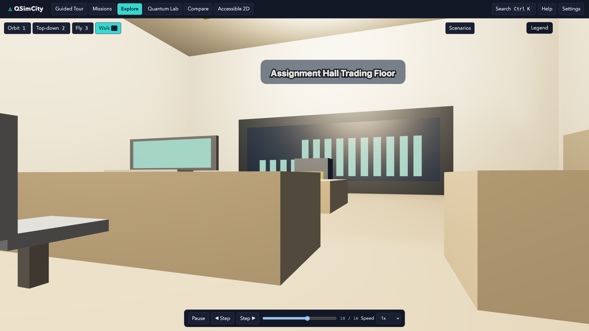

### desktop-day-lab-results.png

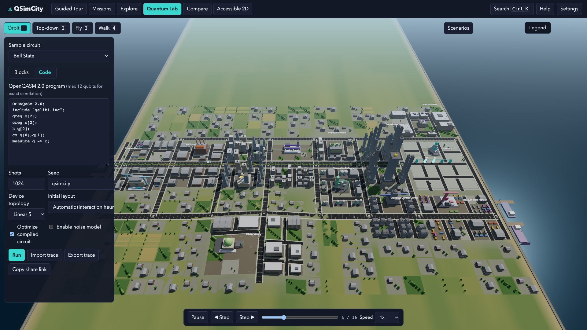

### desktop-day-legend.png

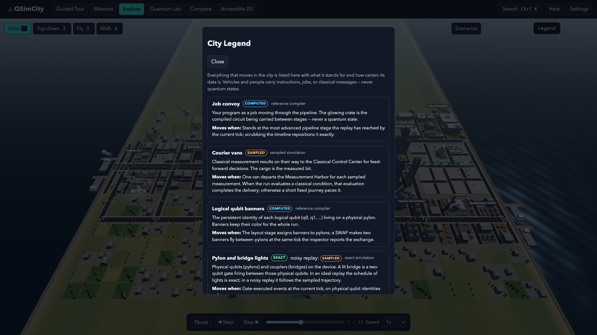

### desktop-day-overview.png

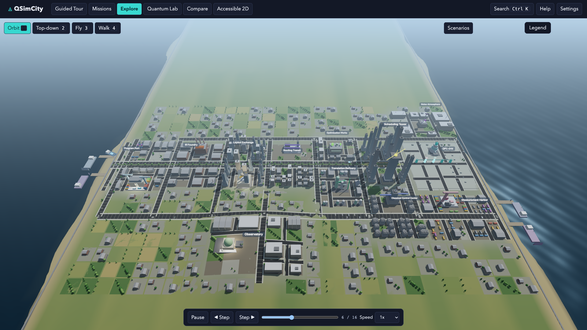

### desktop-day-street.png

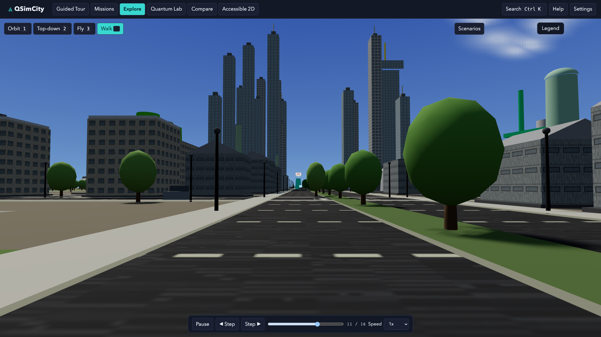

### desktop-golden-overview.png

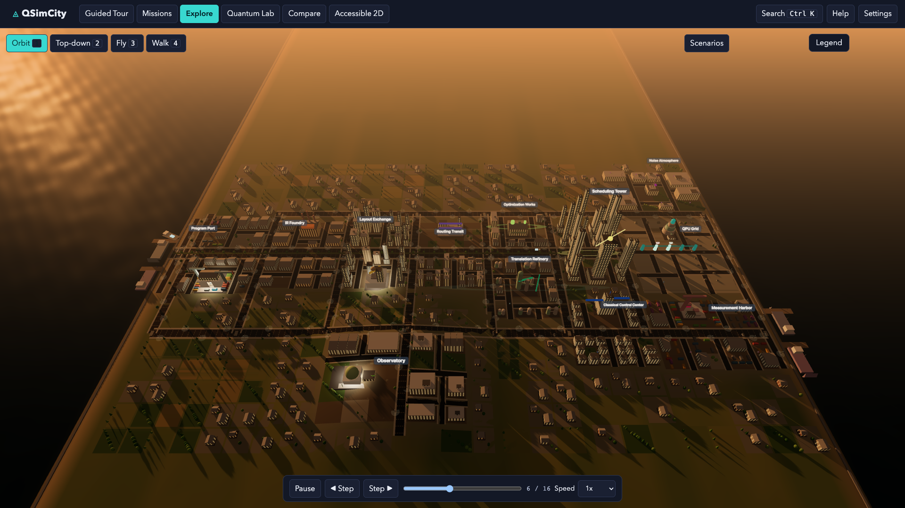

### desktop-golden-street.png

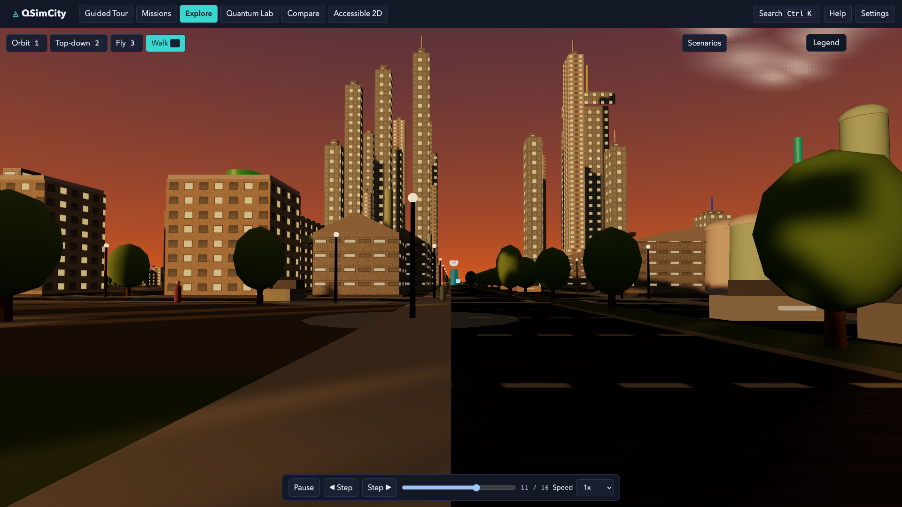

### desktop-night-overview.png

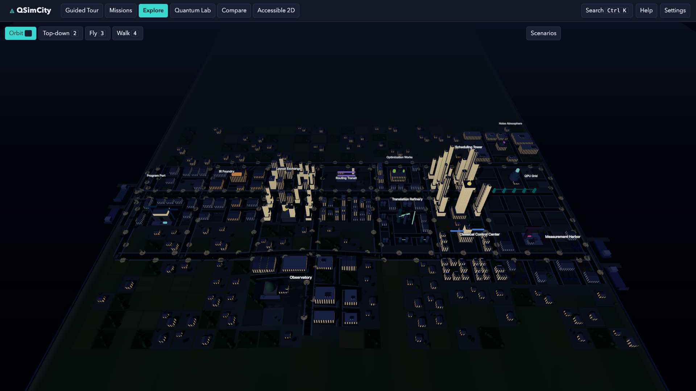

### desktop-night-street.png

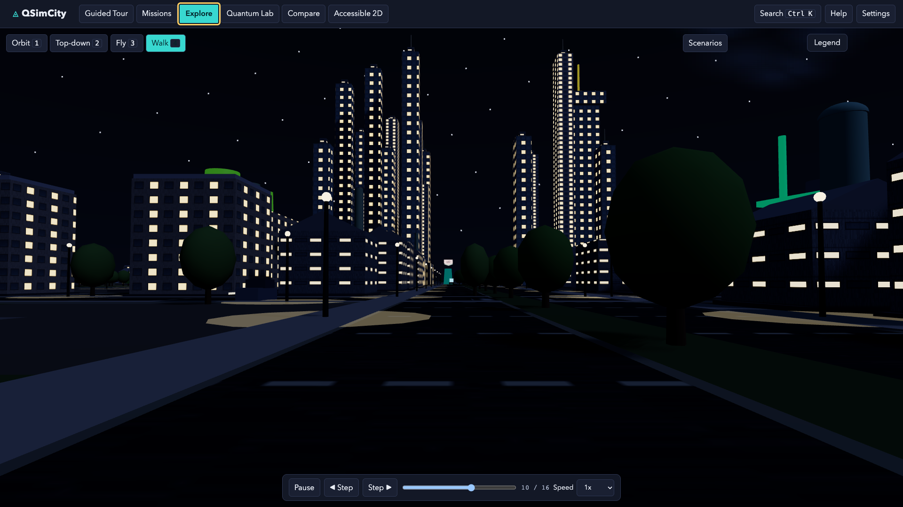

### mobile-day-overview.png

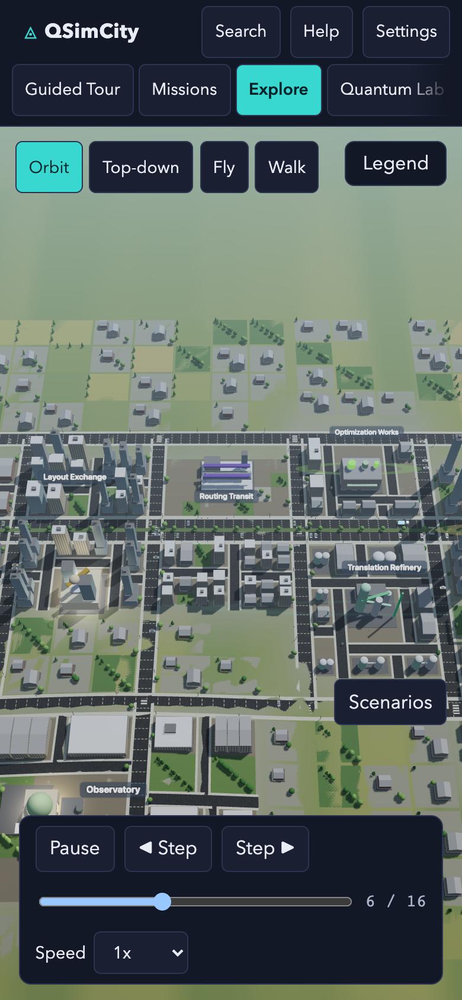

### mobile-day-street.png

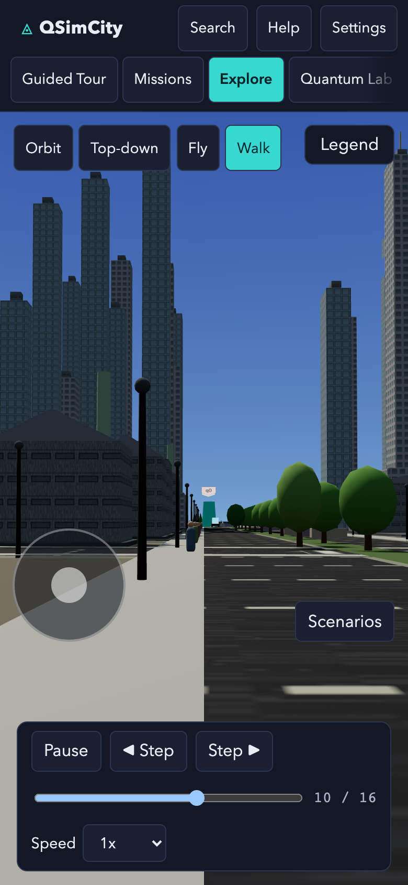

### mobile-golden-overview.png

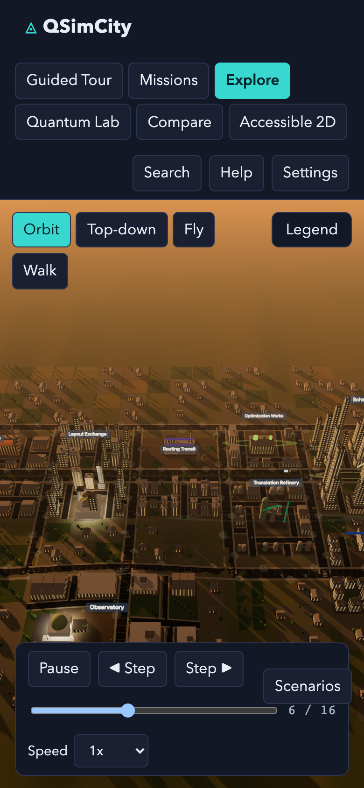

### mobile-golden-street.png

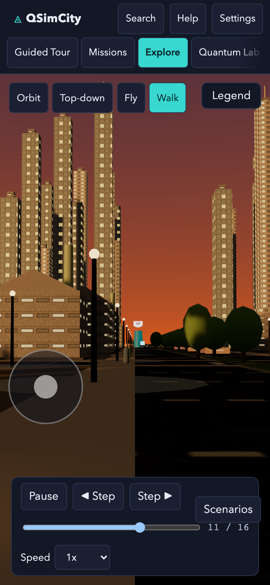

### mobile-night-overview.png

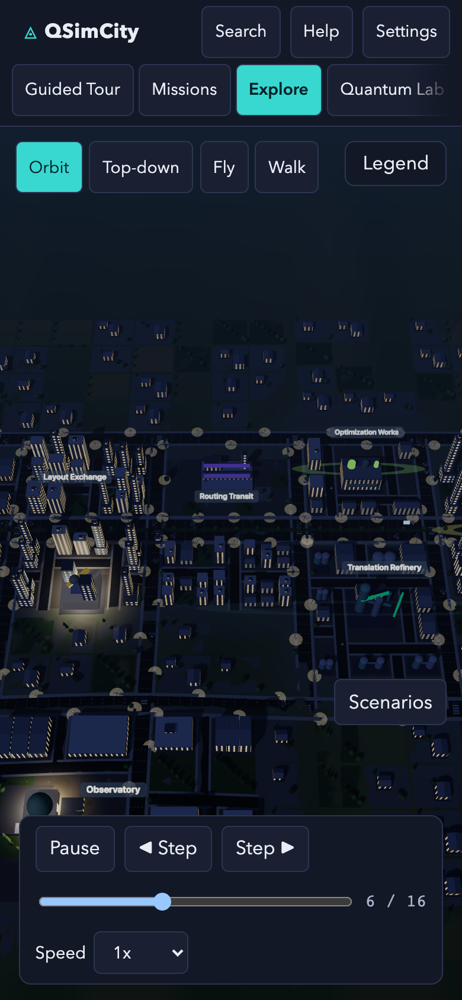

### mobile-night-street.png

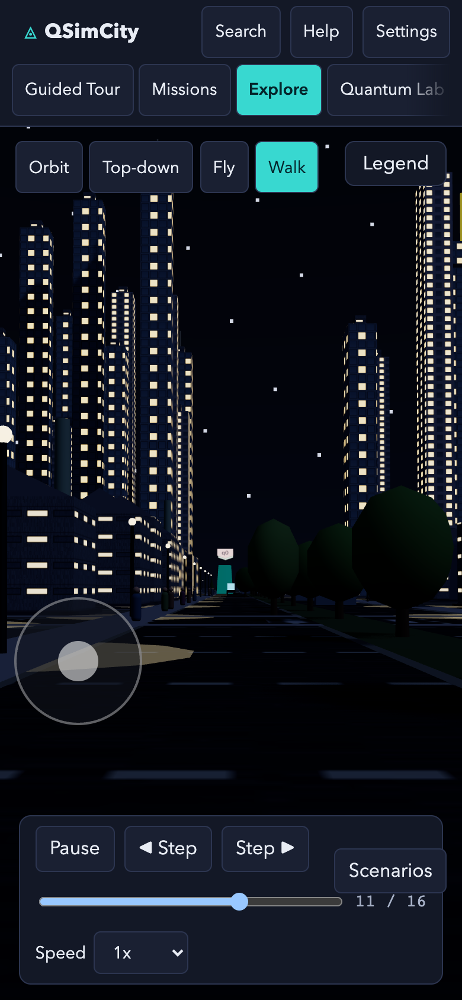
